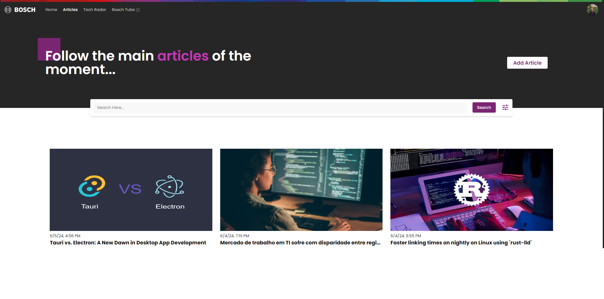
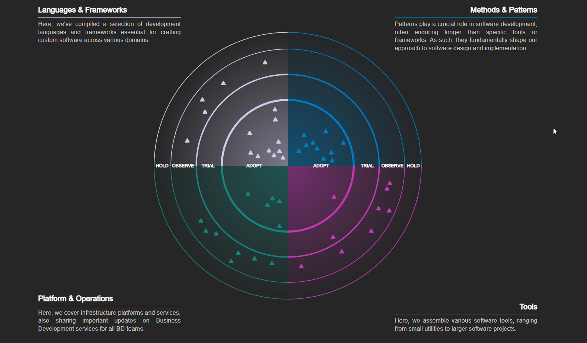

# BDTechCenter


BDTechCenter is a frontend website developed as the final paper for the BD-INN area. Built using Next.js with TypeScript and styled with Tailwind CSS, this project aims to serve as an information centralizer for tech enthusiasts and professionals. The website offers two main features: Tech Articles and Tech Radar. The Tech Articles feature is similar to Medium, providing a platform for publishing and reading articles. The Tech Radar feature presents a graphical representation of various technologies, allowing users to explore the technology landscape.

## Features

### Tech Articles



- A platform for publishing and reading articles, similar to Medium.
- Users can explore a wide range of tech articles written by different authors.
- Articles can be categorized and tagged for easy navigation.

### Tech Radar



- A visual graph representing various technologies.
- Users can interact with the graph to explore different technologies and their interrelations.
- Provides an overview of the current technology landscape.

## Tech Stack

### Core Technologies

- **Next.js**: A React framework for server-side rendering and static site generation.
- **TypeScript**: A strongly typed programming language that builds on JavaScript.
- **Tailwind CSS**: A utility-first CSS framework for rapid UI development.

### Libraries Used

- **D3.js**: A JavaScript library for producing dynamic, interactive data visualizations in web browsers.
- **Zustand**: A small, fast, and scalable state-management solution.
- **shadcn/ui**: A component library for building UI elements.
- **TanStack Query**: A powerful data-fetching and state-management library for React.
- **Zod**: A TypeScript-first schema declaration and validation library.

## Installation

To get started with BDTechCenter, follow these steps:

1. Clone the repository:
   ```bash
   git clone https://github.com/BDTechCenter/front-end.git
   ```
2. Navigate to the project directory:
   ```bash
   cd front-end
   ```
3. Install dependencies:
   ```bash
   npm install
   ```
4. Run the development server:
   ```bash
   npm run dev
   ```

The website should now be running at `http://localhost:3000`.

## Contributing

We welcome contributions from the community. If you'd like to contribute, please follow these steps:

1. Fork the repository.
2. Create a new branch:
   ```bash
   git checkout -b your-feature-branch
   ```
3. Make your changes.
4. Commit your changes:
   ```bash
   git commit -m 'Add your message here'
   ```
5. Push to the branch:
   ```bash
   git push origin your-feature-branch
   ```
6. Create a pull request.

## License

This project is licensed under the MIT License. See the [LICENSE](LICENSE) file for more details.

## Contact

If you have any questions or feedback, feel free to reach out to us at [our email](mailto:luisfelipelfsp3@gmail.com).
